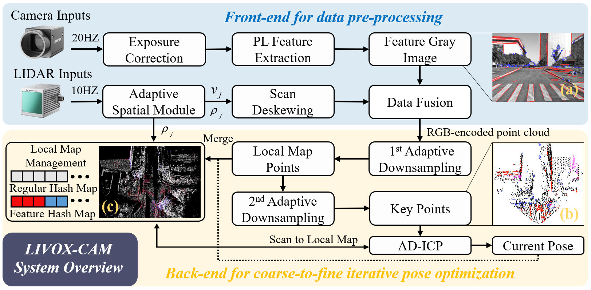

# **LIVOX-CAM: Adaptive Coarse-to-Fine Visual-assisted LiDAR Odometry for Solid-State LiDAR**

## 📌 Overview of LIVOX-CAM

**LIVOX-CAM** is a visual-assisted LiDAR odometry system based on KISS-ICP, designed specifically for small field-of-view (FoV) solid-state LiDAR sensors. The system features a two-stage architecture:  
1. **Front-end Module**: Robust key point extraction.  
2. **Back-end Module**: Coarse-to-fine iterative pose optimization.  

LIVOX-CAM is optimized for stability in various challenging environments, including:
- **Autonomous Driving**  
- **Unstructured Environments**  
- **Handheld Scenarios**  
- **Degenerate Scenarios**  
- **High-altitude Mapping Tasks**

---

### ✅ 1. System Overview
<p align="center">

</p>

#### Multi-layer Local Map Visualization
<p align="center">
    
</p>

#### Support for Color Dense Mapping
<p align="center">
    
</p>

---

### ✅ 2. Dataset Demos

| 📌Dataset                  | Demo |
|--------------------------|------|
| **Garden Dataset**        |  |
| **Geode Dataset**         |  | 
| **M3DGR Dataset**         |  |
| **MARS-LVIG Dataset**     |  |
| **SEU Dataset**           |  |
| **📌Challenging Scenarios** | Demo |
| **Tunnel-degraded Scenarios** |  | 
| **High-altitude Degraded Scenarios** |  |
| **Dark Scene**            |  |

---

## ⚙️ Installation Guide

### 🔧 Recommended System Setup

- **Operating System**: Ubuntu 20.04
- **ROS Version**: ROS Noetic

### 🔧 Dependencies

1. **Livox SDK**  
    ```bash
    cd livox_sdk/build
    cmake ..
    make -j8
    sudo make install
    ```

2. **fmt**  
    ```bash
    cd fmt/build
    cmake ..
    make -j8
    sudo make install
    ```

3. **Eigen**  
    ```bash
    cd eigen/build
    cmake ..
    make -j8
    sudo make install
    ```

4. **Sophus**  
    ```bash
    sudo apt-get install ros-noetic-sophus
    ```

5. **Ceres Solver**  
    ```bash
    sudo apt-get install libceres-dev
    ```

6. **PCL (Point Cloud Library)**  
    ```bash
    sudo apt install libpcl-dev
    sudo apt install pcl-tools
    ```

7. **OpenCV**  
    ```bash
    sudo apt install libopencv-dev python3-opencv
    ```

8. **Other Dependencies**  
    ```bash
    sudo apt-get install ros-noetic-tf2-sensor-msgs
    sudo apt-get install ros-noetic-eigen-conversions
    sudo apt-get install liboctomap-dev
    sudo apt install ros-noetic-octomap ros-noetic-octomap-rviz
    ```

---

### 🔧 Building the Project

```bash
git clone https://github.com/your-repository/livox_cam.git
cd livox_cam
catkin build
source devel/setup.bash
```

###  🔧 Running the System

```bash
roslaunch kiss-lv livox.launch
rosbag play your_data.bag
